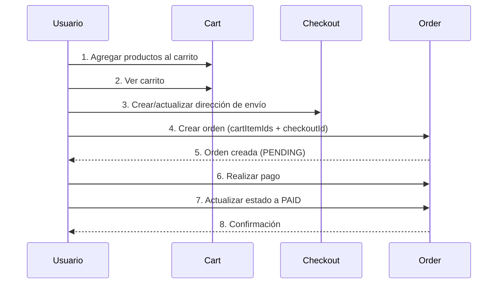

# 🛒 Guía del Flujo de Compra - DropShop

Esta guía explica el flujo completo de compra en DropShop, desde que el usuario agrega productos al carrito hasta que realiza una orden.

## 📋 Flujo General



## 1️⃣ Agregar Productos al Carrito

**Endpoint:** `POST /api/cart`  
**Autenticación:** JWT obligatorio

```http
POST /api/cart
Authorization: Bearer {token}
Content-Type: application/json

{
  "productId": 22,
  "quantity": 2,
  "variant": "Rojo, Talla M"
}
```

**Respuesta:**
```json
{
  "id": 14,
  "productId": 22,
  "userId": 3,
  "quantity": 2,
  "variant": "Rojo, Talla M",
  "createdAt": "2025-11-21T10:30:00"
}
```

### Operaciones adicionales del carrito:

- **Ver mi carrito:** `GET /api/cart`
- **Actualizar cantidad:** `PUT /api/cart/{cartItemId}?quantity=5`
- **Eliminar item:** `DELETE /api/cart/{cartItemId}`
- **Vaciar carrito:** `DELETE /api/cart`

## 2️⃣ Configurar Dirección de Envío (Checkout)

**Endpoint:** `POST /api/checkout`  
**Autenticación:** JWT obligatorio

```http
POST /api/checkout
Authorization: Bearer {token}
Content-Type: application/json

{
  "customerName": "Juan Pérez",
  "customerEmail": "juan@example.com",
  "address": "Av. Siempre Viva 742",
  "city": "Madrid",
  "country": "España",
  "postalCode": "28001",
  "phoneNumber": "+34 600 123 456"
}
```

**Respuesta:**
```json
{
  "id": 5,
  "userId": 3,
  "customerName": "Juan Pérez",
  "customerEmail": "juan@example.com",
  "address": "Av. Siempre Viva 742",
  "city": "Madrid",
  "country": "España",
  "postalCode": "28001",
  "phoneNumber": "+34 600 123 456",
  "createdAt": "2025-11-21T10:35:00",
  "updatedAt": "2025-11-21T10:35:00"
}
```

💡 **Tip:** El usuario puede tener múltiples direcciones guardadas. Usa `GET /api/checkout` para listar todas.

## 3️⃣ Crear la Orden

**Endpoint:** `POST /api/orders`  
**Autenticación:** JWT obligatorio

```http
POST /api/orders
Authorization: Bearer {token}
Content-Type: application/json

{
  "checkoutId": 5,
  "cartItemIds": [14, 15, 16],
  "total": 159.99,
  "notes": "Entregar por la mañana si es posible"
}
```

**Respuesta:**
```json
{
  "id": 1,
  "userId": 3,
  "checkoutId": 5,
  "cartItemIds": [14, 15, 16],
  "status": "PENDING",
  "total": 159.99,
  "notes": "Entregar por la mañana si es posible",
  "createdAt": "2025-11-21T10:40:00",
  "updatedAt": "2025-11-21T10:40:00"
}
```

## 4️⃣ Estados de la Orden

### Estado Inicial: `PENDING`
La orden se crea en estado `PENDING` (pendiente de pago).

### Actualizar a `PAID` (Pagada)

Después de realizar el pago (integración con pasarela externa), actualiza el estado:

```http
PATCH /api/orders/1/status
Authorization: Bearer {token}
Content-Type: application/json

{
  "status": "PAID",
  "notes": "Pago confirmado vía PayPal - ID: XYZ123"
}
```

### Flujo completo de estados:

```
PENDING → PAID → PROCESSING → SHIPPED → DELIVERED
           ↓
        CANCELLED (desde PENDING o PAID)
```

### Cancelar una orden

Solo se pueden cancelar órdenes en estado `PENDING` o `PAID`:

```http
PATCH /api/orders/1/cancel
Authorization: Bearer {token}
```

### Eliminar una orden

Solo se pueden eliminar órdenes en estado `CANCELLED`:

```http
DELETE /api/orders/1
Authorization: Bearer {token}
```

## 5️⃣ Consultar Órdenes

### Ver todas mis órdenes
```http
GET /api/orders
Authorization: Bearer {token}
```

### Ver órdenes por estado
```http
GET /api/orders/status/PAID
Authorization: Bearer {token}
```

Estados disponibles: `PENDING`, `PAID`, `PROCESSING`, `SHIPPED`, `DELIVERED`, `CANCELLED`

### Ver una orden específica
```http
GET /api/orders/1
Authorization: Bearer {token}
```

## 🔐 Seguridad

- ✅ Todas las operaciones requieren JWT válido
- ✅ Cada usuario solo puede ver/modificar sus propias órdenes
- ✅ Los `cartItemIds` son validados contra el carrito del usuario
- ✅ El `checkoutId` debe pertenecer al usuario autenticado

## 📊 Ejemplo Completo: Flujo de Frontend

```javascript
// 1. Usuario autenticado agrega productos al carrito
const addToCart = async (productId, quantity, variant) => {
  const response = await fetch('/api/cart', {
    method: 'POST',
    headers: {
      'Authorization': `Bearer ${token}`,
      'Content-Type': 'application/json'
    },
    body: JSON.stringify({ productId, quantity, variant })
  });
  return response.json();
};

// 2. Usuario completa su dirección de envío
const createCheckout = async (shippingData) => {
  const response = await fetch('/api/checkout', {
    method: 'POST',
    headers: {
      'Authorization': `Bearer ${token}`,
      'Content-Type': 'application/json'
    },
    body: JSON.stringify(shippingData)
  });
  return response.json();
};

// 3. Usuario confirma la compra
const createOrder = async (checkoutId, cartItemIds, total) => {
  const response = await fetch('/api/orders', {
    method: 'POST',
    headers: {
      'Authorization': `Bearer ${token}`,
      'Content-Type': 'application/json'
    },
    body: JSON.stringify({
      checkoutId,
      cartItemIds,
      total,
      notes: "Opcional"
    })
  });
  return response.json();
};

// 4. Después del pago exitoso, actualizar estado
const confirmPayment = async (orderId, paymentId) => {
  const response = await fetch(`/api/orders/${orderId}/status`, {
    method: 'PATCH',
    headers: {
      'Authorization': `Bearer ${token}`,
      'Content-Type': 'application/json'
    },
    body: JSON.stringify({
      status: 'PAID',
      notes: `Pago confirmado - ID: ${paymentId}`
    })
  });
  return response.json();
};

// 5. Vaciar el carrito después de la orden (opcional)
const clearCart = async () => {
  await fetch('/api/cart', {
    method: 'DELETE',
    headers: {
      'Authorization': `Bearer ${token}`
    }
  });
};
```

## 💡 Mejores Prácticas

1. **Validación del Total:** 
   - El frontend debe calcular el total sumando los precios de los `cartItemIds`
   - El backend puede validar este total contra los precios reales

2. **Transaccionalidad:**
   - La creación de la orden NO vacía automáticamente el carrito
   - El frontend debe hacerlo explícitamente después de confirmar el pago

3. **Estados Intermedios:**
   - Usa `PROCESSING` cuando la orden está siendo preparada
   - Usa `SHIPPED` cuando se ha enviado (puedes agregar número de seguimiento en `notes`)
   - Usa `DELIVERED` cuando el cliente confirma la recepción

4. **Manejo de Errores:**
   - Si el pago falla, la orden permanece en `PENDING`
   - El usuario puede intentar pagar de nuevo o cancelar la orden

## 🔄 Integración con Pasarelas de Pago

El sistema está diseñado para integrarse con cualquier pasarela de pago:

1. Frontend inicia el pago con la pasarela (PayPal, Stripe, etc.)
2. Pasarela procesa el pago y devuelve confirmación
3. Frontend actualiza el estado de la orden a `PAID` con el ID de transacción

```javascript
// Ejemplo con PayPal (conceptual)
paypal.Buttons({
  createOrder: async () => {
    // Crear orden en tu backend
    const order = await createOrder(checkoutId, cartItemIds, total);
    return order.id;
  },
  onApprove: async (data, actions) => {
    // Confirmar pago
    await confirmPayment(orderId, data.orderID);
    await clearCart();
    // Redirigir a página de confirmación
  }
}).render('#paypal-button-container');
```

## 📝 Notas Importantes

- Las órdenes NO modifican el stock automáticamente (puedes implementarlo)
- El carrito NO se vacía automáticamente al crear una orden
- Los `cartItemIds` se guardan como referencia pero NO crean relaciones JPA
- Considera agregar campos adicionales como `trackingNumber` para seguimiento de envíos

---

¿Necesitas ayuda con la integración? Consulta la documentación en `/swagger-ui.html`

